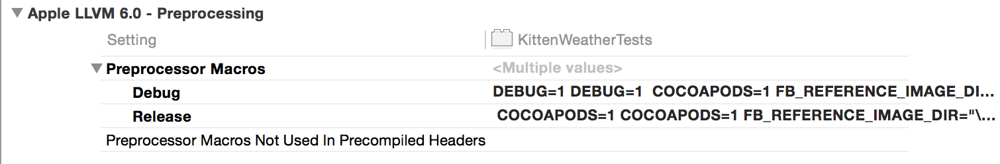

# KittenWeather
Demo Project for CocoaConf 2015 Presentation: "The Best Automated Tests You Don’t Have to Write"

# The Best Automated Tests You Don't Have to Write

- Tests == Good
- Writing Tests == PITA
	- Happy path, failing path, edge cases, sanity tests, etc.
- How to use open-source tools to maximize benefit:effort ratio
- "People think computers will keep them from making mistakes. They're wrong. With computers you make mistakes faster." -Adam Osborne

## KittenWeather

- "Because Kittens Make Everything Better"
- https://github.com/SeanMcTex/KittenWeather
- Show app
- Demonstrate features
- But KittenWeather has some problems, and we're going to use some automated tools to find them.

## UIAutoMonkey
- https://github.com/jonathanpenn/ui-auto-monkey
- written by Jonathan Penn, inspired by Netflix' [Chaos Monkey](https://github.com/Netflix/SimianArmy/wiki/Chaos-Monkey)
	- Chaos Monkey is a project from Netflix that randomly kills off systems in a cloud cluster
	- Only does it during business hours so folks are available to respond to and learn from the failures
	- Has helped make Netflix' infrastructure much more resiliant than it otherwise would have been
- Uses UIAutomation framework, which is usually used for functional testing, to stress-test iOS apps by firing all kinds of random UI events: taps, swipes, rotations, pinches, shakes, etc.
- Does two things for us: helps to generate UI states we may not have thought of, and allows us to profile the app under continuous usage conditions

### Using UIAutoMonkey

1. Load project in Xcode
1. CMD-I to launch Instruments
1. Choose Automation template
	- You can add additional tests later on if you want to monitor other aspects of how the app responds under stress.
1. Make sure Script pane is selected.
1. Add new script in Display Settings panel
1. Paste in the UIAutoMonkey.js file
1. Press Run

### Fixing the problem
- Multiple copies of the About view provide a clue as to what's going on
- Add appropriate check to ViewController -didTapAbout;
- Rerun the monkey, verify that multiple about views and crash no longer occur.

### A Bit More On The Monkey

- Pretty heavily customizable. See options at top of .js file.
- Because of randomness, tests aren't repeatable. Don't necessarily make this part of your unit test suite, but bring it to bear often.

## QuickCheck and Friends

* QuickCheck originated in Haskell and has been ported to lots of other languages
* Generates lots of values in a deterministic way, sets class properties, and verifies that what's true should still be true. "The programmer provides a specification of the program, in the form of properties which functions should satisfy, and QuickCheck then tests that the properties hold in a large number of randomly generated cases."
* I cheated: you still have to write these tests. But the payoff is that if you write them once, you essentially get hundreds of tests for free.
* The most mature library for doing this sort of testing in Cocoa is called Fox. It lives at https://github.com/jeffh/Fox, and has support for Objective C, as well as a DSL underway development for Swift.

### Setting up Fox

- Can be done either as a git submodule:

		git submodule add https://github.com/jeffh/Fox.git Externals/Fox

- Or as a CocoaPods install

		pod 'Fox', '~>1.0.1'

### Write the Tests

- My Temperature class needs some sanity checking. It supports temperatures in Imperial (Farenheit), Celsius, and Kelvin. And while it shouldn't be obvious from the public interface, we store the temperature internally in degrees Kelvin. (Show code.)
- Some of the most basic checks we can do on our Temperature class, then, are making sure that the number of degrees we put into an instance is the same as the number of degrees we get out when we query the object later. Here's what that test looks like for Kelvin temperatures.

		- (void)testIdentityKelvin {
		    id<FOXGenerator> kelvinTemperatureGenerator = FOXFloat();
		    FOXAssert( FOXForAll(kelvinTemperatureGenerator, ^BOOL(NSNumber *kelvinTemperatureNumber) {
		        Temperature *temperature = [Temperature temperatureWithKelvinDegrees:[kelvinTemperatureNumber floatValue]];
		        float difference = abs( [kelvinTemperatureNumber floatValue] - temperature.kelvinDegrees );
		        if ( difference > 0.1 ) {
		            return NO;
		        } else {
		            return  YES;
		        }
		    }));
		}

### Fix Problems

- Note that the test for Imperial units is failing for very large values. This suggests a rounding error.
- Look at the error; note that it makes an effort to shrink to the smallest value that triggers the problem.
- Change math to use long doubles. Rerun tests, verify problem is now fixed.

### More About Fox

- Includes a ton of generators for all kinds of numeric, collection, string, and id data types.
- You can create your own as well.
- Tutorial: http://fox-testing.readthedocs.org/en/latest/tutorial.html
- Swift DSL still under development.

## Making Sure Your UI is Stable with FBSnapshotTestCase
- Testing UI is tough.
- FBSnapshotTestCase https://github.com/facebook/ios-snapshot-test-case
- Takes a baseline image of a UIView, compares it to image generated on subsequent runs.

### Setup
- Use Pod

		pod 'FBSnapshotTestCase'

- Add preprocessor definitions

### First Run (setting baselines)

	#import "FBSnapshotTestCase.h"
	...
	@interface ViewTests : FBSnapshotTestCase
	...
	-(void)setUp {
	    [super setUp]; // IMPORTANT!
	    self.recordMode = YES;
	    self.viewController = [[UIStoryboard storyboardWithName:@"Main" bundle:nil] instantiateInitialViewController];
	}

	- (void)testRootView {
	    FBSnapshotVerifyView( self.viewController.view, nil );
	}

### Let Us Know if Something Changes

- Change placeholder text in IB
- Rerun tests
- Note test has failed
- Look at log
- Demonstrate Kaleidescope call
- Demonstrate Xcode plugin https://github.com/orta/snapshots
- If you determine the new snapshot looks good, simply reset the baseline.

### A Few More Things

- Can be pointed to any UIView. Very useful for custom UIView subclasses.
- Setting this up to run automatically on different device sizes is possible, but is something of a headache.
- http://www.objc.io/issue-15/snapshot-testing.html has more details

## Conclusion

- Even if you don't go full-in on TDD or exhaustive unit testing, you can get a lot of value from automated tests.
- Look for tools that will maximize the benefit to effort ratio for your particular circumstances.
- "If you don’t like testing your product, most likely your customers won’t like to test it either."
